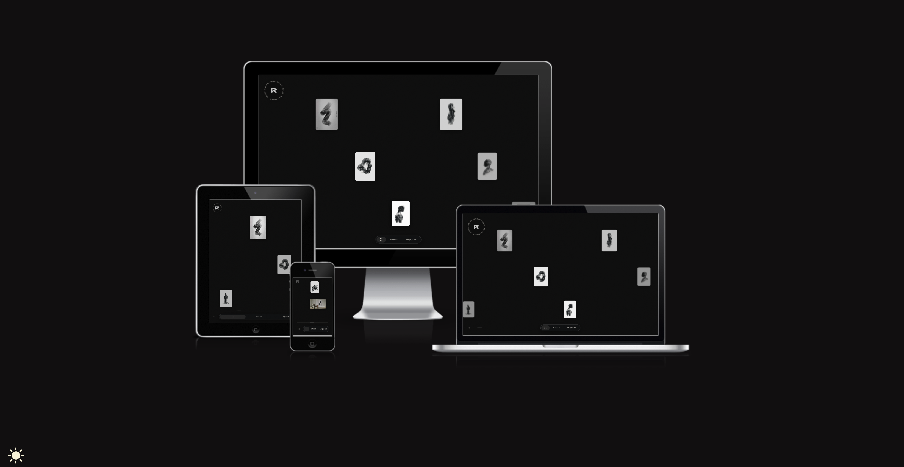
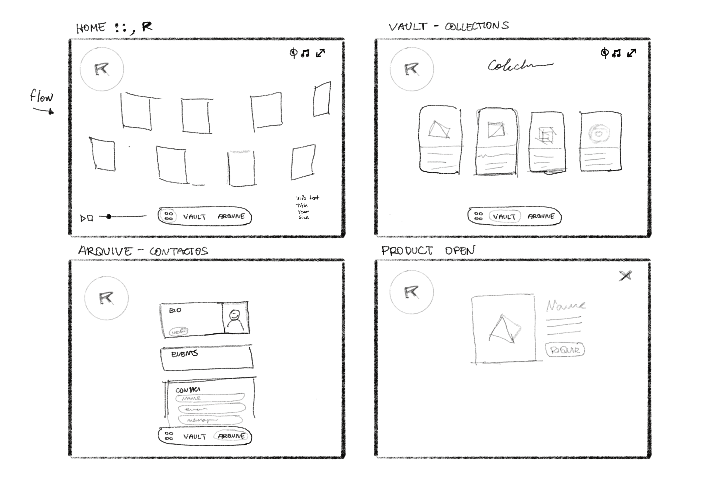
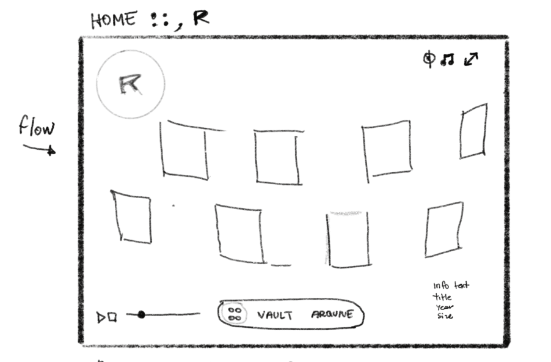
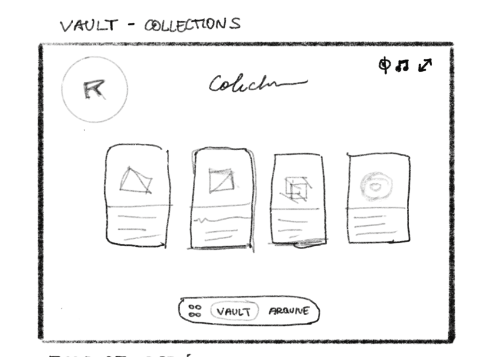

# [raigon-mmxi](https://raigonlab.github.io/raigon-mmxi)

Developer: Railson Goncalves ([raigonlab](https://www.github.com/raigonlab))

---

## Project Introduction and Rationale

raigon-mmxi is an interactive digital art gallery built to showcase the original artwork of Raigon, a Zürich-based artist and tattooist working at the intersection of art, body, and technology. The project presents the *Carvão Digital* series — nineteen original digital works — through an immersive, user-controlled experience.

The target audience includes art collectors and clients interested in acquiring or commissioning work, as well as fellow artists and creatives who engage with the work conceptually. The site prioritises the artwork itself, using a minimal dark interface so the pieces remain the focal point.

The rationale behind this project was to build something that reflects the quality of the work it presents. As an artist and designer, I wanted the experience of browsing the gallery to feel as considered as the artwork itself. This meant building custom interactions — infinite parallax scroll, depth-of-field focus effects, animated canvas backgrounds — rather than relying on off-the-shelf components. The project uses the Fetch API to load collection data asynchronously, demonstrating real-world async patterns with proper error handling.

#### [You can check the Live Here!](https://raigonlab.github.io/raigon-mmxi)

---

source: https://ui.dev/amiresponsive?url=https://raigonlab.github.io/raigon-mmxi

---

## UX

### The 5 Planes of UX

#### 1. Strategy

**Purpose**

* Present original digital artwork in an immersive, interactive gallery
* Allow users to explore curated collections and contact the artist

**Primary User Needs**

* Browse and view artwork with full detail
* Understand the artist's visual identity and body of work
* Find contact information easily

**Business Goals**

* Attract collectors and commission inquiries
* Establish a strong, distinct visual identity online
* Demonstrate technical and design craftsmanship

---

#### 2. Scope

**Features**

* Infinite parallax gallery with depth-of-field effect
* Full-screen artwork modal with keyboard navigation
* Animated topographic canvas (Vault section)
* Curated collections loaded via async fetch
* Artist biography and contact section
* Custom 404 page with automatic redirect

**Content Requirements**

* Original artwork images with title, series, year, and description
* Artist biography
* Contact and social media links

---

#### 3. Structure

**Information Architecture**

* Single-page application with three sections: Home, Vault, Arquive
* Persistent bottom navigation pill bar
* No page reloads — all transitions are JavaScript-driven

**User Flow Desktop**

1. User lands on the Home gallery

2. Drags or scrolls to explore the artwork

3. Clicks an artwork to open the full-screen modal

4. Navigates to Vault to explore collections

5. Navigates to Arquive to find contact information

**User Flow Mobile**

1. User lands on the Home gallery

2. Swipes to explore the artwork

3. Taps an artwork to open the modal

4. Navigates to Vault

5. Navigates to Arquive

---

#### 4. Skeleton

Wireframes were created before development began, covering both mobile and desktop layouts.

---

#### 5. Surface

**Visual Design**

* Minimal dark interface — near-black backgrounds with warm gold accent (`#c8a96e`)
* Editorial typography pairing: Cormorant Garamond (serif) for artwork information, Syne (geometric sans) for UI labels
* Artwork is always the visual priority — interface elements are intentionally subdued

---

## Colour Scheme

* Dark, editorial scheme centred on the artwork:

* Background: `#05040a`
* Surface: `#111110`
* Accent: `#c8a96e`
* Text: `#e8e4dc`
* Muted: `rgba(232,228,220,0.4)`

Clean, minimal, and designed to frame artwork without competing with it.

---

## Typography

* **Cormorant Garamond** — used for artwork titles, descriptions, and editorial content. Sourced from Google Fonts.
* **Syne** — used for navigation labels, section headers, and UI elements. Sourced from Google Fonts.

The pairing creates a clear visual hierarchy: Cormorant Garamond carries the artistic voice, Syne handles the interface.

---

## Wireframes

Wireframes were created to define layout and structure across devices before any code was written.

| Screen | Wireframe |
| ------ | --------- |
| Home (gallery) |  |
| Artwork Modal |  |
| Vault |  |
| Arquive |  |

---

## User Stories

| Target | Expectation | Outcome |
| ------ | ----------- | ------- |
| As an art collector | I want to browse artwork in a visually immersive gallery | So I can evaluate pieces for acquisition |
| As an art collector | I want to view an artwork in full detail | So I can see the title, series, year, and description |
| As an art collector | I want to navigate between artworks without closing the viewer | So my browsing flow is uninterrupted |
| As a creative / peer artist | I want to understand the artist's visual language | So I can engage meaningfully with the work |
| As a creative / peer artist | I want to explore curated collections by theme | So I can discover conceptual groupings |
| As a site visitor | I want to find contact information easily | So I can get in touch or follow on social media |
| As a site visitor | I want to use the site on any device | So I have a consistent experience on mobile and desktop |
| As a site visitor | I want feedback when my actions produce a result | So I always know what the site is doing |
| As a site visitor | I want a 404 page | So I know when something has gone wrong |

---

## Features

### Existing Features

| Feature | Description |
| ------- | ----------- |
| Parallax Gallery | Two-layer infinite horizontal scroll with auto-scroll, drag, and mouse-edge scroll |
| Depth-of-field Effect | Central artwork cards are sharp; edges blur and fade progressively |
| Artwork Modal | Full-screen viewer with title, series, year, description, and prev/next navigation |
| Keyboard Navigation | Arrow keys navigate between artworks; Escape closes the modal |
| Topographic Canvas | Animated noise-curve canvas in the Vault section, reactive to mouse position |
| Async Collections | Collection data loaded via Fetch API with loading and error states |
| Arquive / Contact | Artist biography and contact links, all external links open in a new tab |
| 404 Page | Custom error page with automatic redirect to homepage after 5 seconds |
| Favicon | Branding element |

---

### Future Features

* Search and filter for the gallery
* Individual collection gallery views (Pyramid, Shell, Lake)
* Commission inquiry form with validation

---

## Tools & Technologies

* HTML5
* CSS3
* JavaScript (ES6+)
* Canvas API
* Fetch API
* Git & GitHub
* GitHub Pages
* Figma
* Google Fonts
* ChatGPT / Claude

---

## Agile Development Process

GitHub Projects and Issues were used to plan and track the development.

[Link to Project Board](https://github.com/users/raigonlab/projects/2)

---

## Testing

All testing details are available in:

👉 [TESTING.md](TESTING.md)

---

## Deployment

### Live Website

- The site was deployed to GitHub Pages. The steps to deploy are as follows:
  - In the GitHub repository, navigate to the Settings tab
  - From the Code and automation section drop-down menu, select Pages
  - In the build and deployment area, choose from source "deploy from a branch" and then choose the main branch, root folder, and save
  - Once saved, the page will be automatically refreshed with a ribbon confirming successful deployment (it can take around 5 minutes for the link to appear)

Live link: https://raigonlab.github.io/raigon-mmxi

> **Note:** the `fetch()` call for collection data requires a server context. When running locally, use a local server such as the VS Code Live Server extension or `python -m http.server` rather than opening `index.html` directly in the browser.

---

## Credits

### Content

* MDN Web Docs — Canvas API and Fetch API reference
* Code Institute materials
* ChatGPT / Claude (debugging & explanations)
* Fonts.google.com

---

### Media

* All artwork images are original works by Raigon (© Raigon Lab, MMXXIII)
* Logo and symbol images are original works by Raigon

---

## Acknowledgements

Special thanks to my mentor for guidance and support throughout the project.

---